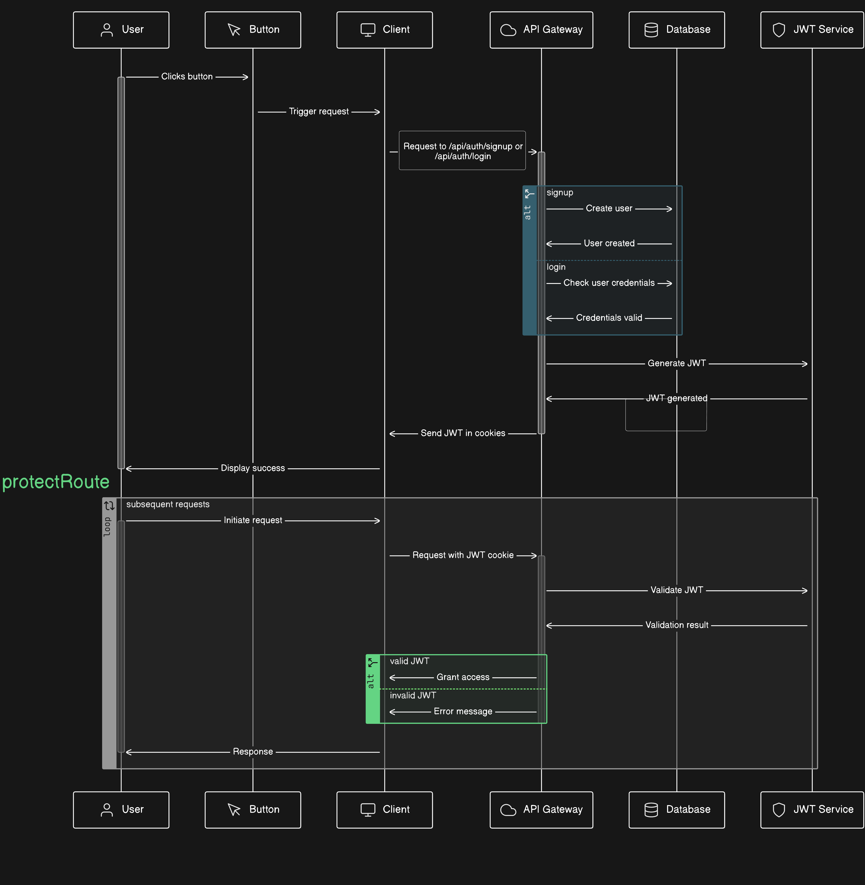

# Streamify

A modern full-stack social chat app built for language exchange, real-time conversations, and video calling. The project combines a React frontend with an Express and MongoDB backend, using Stream for chat and calling features.



## Features

- Real-time one-to-one chat experience
- Friend requests and social connections
- Notifications for new activity
- Profile onboarding and profile editing
- Profile pictures with local upload support
- Video calling support through Stream
- Responsive UI with Tailwind CSS and DaisyUI
- Multiple themes for a personalized experience

## Tech Stack

### Frontend
- React 19
- Vite
- React Router
- TanStack Query
- Zustand
- Tailwind CSS + DaisyUI
- Stream Chat and Video SDK
- React Hot Toast

### Backend
- Node.js + Express
- MongoDB + Mongoose
- JWT authentication
- Cookie-based auth
- Stream Chat backend integration

## Project Structure

```bash
streamify-main/
├── backend/
│   ├── src/
│   │   ├── controllers/
│   │   ├── lib/
│   │   ├── middleware/
│   │   ├── models/
│   │   └── routes/
│   └── package.json
├── frontend/
│   ├── src/
│   │   ├── components/
│   │   ├── hooks/
│   │   ├── pages/
│   │   ├── store/
│   │   └── lib/
│   └── package.json
└── README.md
```

## Environment Variables

Create a `.env` file in the backend folder:

```env
PORT=5001
MONGO_URI=your_mongodb_connection_string
STEAM_API_KEY=your_stream_api_key
STEAM_API_SECRET=your_stream_api_secret
JWT_SECRET_KEY=your_jwt_secret
NODE_ENV=development
```

Create a `.env` file in the frontend folder:

```env
VITE_STREAM_API_KEY=your_stream_api_key
```

## Installation

### 1. Install dependencies

```bash
cd backend
npm install

cd ../frontend
npm install
```

### 2. Start the backend

```bash
cd backend
npm run dev
```

### 3. Start the frontend

```bash
cd frontend
npm run dev
```

The frontend should run at http://localhost:5173 and the backend at http://localhost:5001.

## Usage

1. Sign up or log in to the app.
2. Complete onboarding and set up your profile.
3. Send friend requests and accept incoming requests.
4. Start chatting or begin a video call with a connected friend.

## Notes

- Make sure MongoDB is running and reachable through your configured connection string.
- Stream credentials are required for chat and video call functionality.
- The app uses cookies for authentication, so the frontend and backend must be served with the expected CORS setup.
